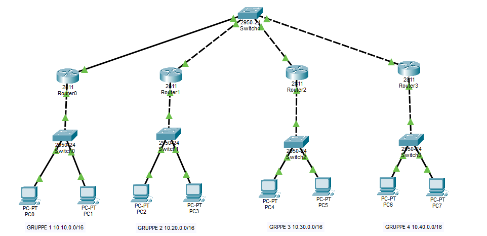

- [Grundlagen](#grundlagen)
  - [Was ist Static Routing?](#was-ist-static-routing)
  - [Static vs. Dynamic Routing](#static-vs.-dynamic-routing)
  - [Default Route und spezifische
    Routen](#default-route-und-spezifische-routen)
  - [Subinterfaces am Router](#subinterfaces-am-router)
- [Topologie und Adressierung](#topologie-und-adressierung)
  - [Rahmenbedingungen](#rahmenbedingungen)
  - [Subnetzplan](#subnetzplan)
  - [Interface-Belegung](#interface-belegung)
    - [Gruppe 1](#gruppe-1)
    - [Gruppe 2](#gruppe-2)
    - [Gruppe 3](#gruppe-3)
    - [Gruppe 4](#gruppe-4)
  - [Logische Netzzeichnung](#logische-netzzeichnung)
- [IP-Tabellen pro Gruppe](#ip-tabellen-pro-gruppe)
  - [Gruppe 1](#gruppe-1-1)
  - [Gruppe 2](#gruppe-2-1)
  - [Gruppe 3](#gruppe-3-1)
  - [Gruppe 4](#gruppe-4-1)
- [Aufgabe: Router-on-a-Stick und Static
  Routing](#aufgabe-router-on-a-stick-und-static-routing)
  - [Teil A: Router-on-a-Stick in der eigenen
    Gruppe](#teil-a-router-on-a-stick-in-der-eigenen-gruppe)
  - [Teil B: Transportnetz und statische
    Routen](#teil-b-transportnetz-und-statische-routen)
  - [Teil C: Funktionsprüfung](#teil-c-funktionsprüfung)
  - [Hilfreiche Cisco-Kommandos](#hilfreiche-cisco-kommandos)

# Grundlagen

## Was ist Static Routing?

Statisches Routing bedeutet, dass Routen manüll am Router eingetragen
werden. Der Router lernt diese Wege nicht dynamisch, sondern verwendet
exakt die konfigurierten Einträge.

Auf Cisco-Routern wird eine statische Route typischerweise so gesetzt:

    ip route <zielnetz> <netzmaske> <next-hop-ip oder ausgangsinterface>

Beispiel:

    ip route 10.30.10.0 255.255.255.0 172.16.0.13

Der Router weiss dann, dass das Netz `10.30.10.0/24` über den nächsten
Router mit der Adresse `172.16.0.13` erreichbar ist.

## Static vs. Dynamic Routing

- **Static Routing:** wenig Overhead, sehr kontrollierbar, aber mehr
  manüller Aufwand.

- **Dynamic Routing:** Routen werden automatisch gelernt (z. B. OSPF,
  EIGRP, RIP), dafür mehr Protokollverkehr und komplexere Konfiguration.

Für kleine bis mittlere Topologien ist Static Routing gut geeignet, wenn
der Netzaufbau stabil ist und sich selten ändert.

## Default Route und spezifische Routen

Eine spezifische Route gilt für ein bestimmtes Zielnetz. Eine Default
Route (`0.0.0.0/0`) ist eine Auffangroute für alle Ziele, für die keine
spezifischere Route vorhanden ist.

In dieser Übung werden **spezifische statische Routen** zu allen anderen
Gruppennetzen konfiguriert.

## Subinterfaces am Router

Bevor statische Routen zwischen den Gruppen funktionieren, muss in jeder
Gruppe zuerst das lokale Inter-VLAN-Routing laufen. Dafuer wird
Router-on-a-Stick mit Subinterfaces verwendet.

Ein Subinterface ist ein virtuelles Teilinterface auf einem physischen
Port (z. B. `Gi0/0.10` oder `Fa0/0.10`). Es hat zwei Aufgaben:

- VLAN-Zuordnung ueber `encapsulation dot1Q <VLAN-ID>`

- Gateway-IP fuer genau dieses VLAN

Beispiel:

    interface gi0/0.10 (oder fa0/0.10)
     encapsulation dot1Q 10
     ip address 10.10.10.254 255.255.255.0

    interface gi0/0.20 (oder fa0/0.20)
     encapsulation dot1Q 20
     ip address 10.10.20.254 255.255.255.0

Erst wenn diese lokalen Gateways funktionieren, koennen Pakete
anschliessend per statischer Route in die anderen Gruppen weitergeleitet
werden.

# Topologie und Adressierung

## Rahmenbedingungen

Es gibt 4 Gruppen. Jede Gruppe erhält:

- 1x Cisco Catalyst 3550 Switch

- 1x Cisco 2800 Series Router

- 2 lokale Netze (VLANs) im Router-on-a-Stick-Design

- pro lokalem Netz 1 PC

Adressregel in jedem lokalen Netz:

- PC: `.1`

- Switch (SVI): `.253`

- Router-Subinterface (Gateway): `.254`

Transportnetz zwischen den Gruppenroutern:

- `172.16.0.0/24`

## Subnetzplan

- Gruppe 1: `10.10.10.0/24` und `10.10.20.0/24`

- Gruppe 2: `10.20.10.0/24` und `10.20.20.0/24`

- Gruppe 3: `10.30.10.0/24` und `10.30.20.0/24`

- Gruppe 4: `10.40.10.0/24` und `10.40.20.0/24`

## Interface-Belegung

### Gruppe 1

| Verbindung               | Linke Seite               | Rechte Seite                    |
|:-------------------------|:--------------------------|:--------------------------------|
| G1-PC1 zu G1-SW          | G1-PC1 NIC                | G1-SW Fa0/1                     |
| G1-PC2 zu G1-SW          | G1-PC2 NIC                | G1-SW Fa0/2                     |
| G1-SW zu G1-RTR (Trunk)  | G1-SW Fa0/24              | G1-RTR Gi0/0 (oder Fa0/0)       |
| G1-RTR ins Transportnetz | G1-RTR Gi0/1 (oder Fa0/1) | Transport-Segment 172.16.0.0/24 |

### Gruppe 2

| Verbindung               | Linke Seite               | Rechte Seite                    |
|:-------------------------|:--------------------------|:--------------------------------|
| G2-PC1 zu G2-SW          | G2-PC1 NIC                | G2-SW Fa0/1                     |
| G2-PC2 zu G2-SW          | G2-PC2 NIC                | G2-SW Fa0/2                     |
| G2-SW zu G2-RTR (Trunk)  | G2-SW Fa0/24              | G2-RTR Gi0/0 (oder Fa0/0)       |
| G2-RTR ins Transportnetz | G2-RTR Gi0/1 (oder Fa0/1) | Transport-Segment 172.16.0.0/24 |

### Gruppe 3

| Verbindung               | Linke Seite               | Rechte Seite                    |
|:-------------------------|:--------------------------|:--------------------------------|
| G3-PC1 zu G3-SW          | G3-PC1 NIC                | G3-SW Fa0/1                     |
| G3-PC2 zu G3-SW          | G3-PC2 NIC                | G3-SW Fa0/2                     |
| G3-SW zu G3-RTR (Trunk)  | G3-SW Fa0/24              | G3-RTR Gi0/0 (oder Fa0/0)       |
| G3-RTR ins Transportnetz | G3-RTR Gi0/1 (oder Fa0/1) | Transport-Segment 172.16.0.0/24 |

### Gruppe 4

| Verbindung               | Linke Seite               | Rechte Seite                    |
|:-------------------------|:--------------------------|:--------------------------------|
| G4-PC1 zu G4-SW          | G4-PC1 NIC                | G4-SW Fa0/1                     |
| G4-PC2 zu G4-SW          | G4-PC2 NIC                | G4-SW Fa0/2                     |
| G4-SW zu G4-RTR (Trunk)  | G4-SW Fa0/24              | G4-RTR Gi0/0 (oder Fa0/0)       |
| G4-RTR ins Transportnetz | G4-RTR Gi0/1 (oder Fa0/1) | Transport-Segment 172.16.0.0/24 |

## Logische Netzzeichnung

# IP-Tabellen pro Gruppe

## Gruppe 1

| Gerät  | Interface                | IP-Adresse   | Maske         | Default Gateway |
|:-------|:-------------------------|:-------------|:--------------|:----------------|
| G1-PC1 | NIC                      | 10.10.10.1   | 255.255.255.0 | 10.10.10.254    |
| G1-PC2 | NIC                      | 10.10.20.1   | 255.255.255.0 | 10.10.20.254    |
| G1-SW  | VLAN 10 (SVI)            | 10.10.10.253 | 255.255.255.0 | 10.10.10.254    |
| G1-SW  | VLAN 20 (SVI)            | 10.10.20.253 | 255.255.255.0 | 10.10.20.254    |
| G1-RTR | Gi0/0.10 (oder Fa0/0.10) | 10.10.10.254 | 255.255.255.0 | \-              |
| G1-RTR | Gi0/0.20 (oder Fa0/0.20) | 10.10.20.254 | 255.255.255.0 | \-              |
| G1-RTR | Gi0/1 (oder Fa0/1)       | 172.16.0.11  | 255.255.255.0 | \-              |

## Gruppe 2

| Gerät  | Interface                | IP-Adresse   | Maske         | Default Gateway |
|:-------|:-------------------------|:-------------|:--------------|:----------------|
| G2-PC1 | NIC                      | 10.20.10.1   | 255.255.255.0 | 10.20.10.254    |
| G2-PC2 | NIC                      | 10.20.20.1   | 255.255.255.0 | 10.20.20.254    |
| G2-SW  | VLAN 10 (SVI)            | 10.20.10.253 | 255.255.255.0 | 10.20.10.254    |
| G2-SW  | VLAN 20 (SVI)            | 10.20.20.253 | 255.255.255.0 | 10.20.20.254    |
| G2-RTR | Gi0/0.10 (oder Fa0/0.10) | 10.20.10.254 | 255.255.255.0 | \-              |
| G2-RTR | Gi0/0.20 (oder Fa0/0.20) | 10.20.20.254 | 255.255.255.0 | \-              |
| G2-RTR | Gi0/1 (oder Fa0/1)       | 172.16.0.12  | 255.255.255.0 | \-              |

## Gruppe 3

| Gerät  | Interface                | IP-Adresse   | Maske         | Default Gateway |
|:-------|:-------------------------|:-------------|:--------------|:----------------|
| G3-PC1 | NIC                      | 10.30.10.1   | 255.255.255.0 | 10.30.10.254    |
| G3-PC2 | NIC                      | 10.30.20.1   | 255.255.255.0 | 10.30.20.254    |
| G3-SW  | VLAN 10 (SVI)            | 10.30.10.253 | 255.255.255.0 | 10.30.10.254    |
| G3-SW  | VLAN 20 (SVI)            | 10.30.20.253 | 255.255.255.0 | 10.30.20.254    |
| G3-RTR | Gi0/0.10 (oder Fa0/0.10) | 10.30.10.254 | 255.255.255.0 | \-              |
| G3-RTR | Gi0/0.20 (oder Fa0/0.20) | 10.30.20.254 | 255.255.255.0 | \-              |
| G3-RTR | Gi0/1 (oder Fa0/1)       | 172.16.0.13  | 255.255.255.0 | \-              |

## Gruppe 4

| Gerät  | Interface                | IP-Adresse   | Maske         | Default Gateway |
|:-------|:-------------------------|:-------------|:--------------|:----------------|
| G4-PC1 | NIC                      | 10.40.10.1   | 255.255.255.0 | 10.40.10.254    |
| G4-PC2 | NIC                      | 10.40.20.1   | 255.255.255.0 | 10.40.20.254    |
| G4-SW  | VLAN 10 (SVI)            | 10.40.10.253 | 255.255.255.0 | 10.40.10.254    |
| G4-SW  | VLAN 20 (SVI)            | 10.40.20.253 | 255.255.255.0 | 10.40.20.254    |
| G4-RTR | Gi0/0.10 (oder Fa0/0.10) | 10.40.10.254 | 255.255.255.0 | \-              |
| G4-RTR | Gi0/0.20 (oder Fa0/0.20) | 10.40.20.254 | 255.255.255.0 | \-              |
| G4-RTR | Gi0/1 (oder Fa0/1)       | 172.16.0.14  | 255.255.255.0 | \-              |

# Aufgabe: Router-on-a-Stick und Static Routing

## Teil A: Router-on-a-Stick in der eigenen Gruppe

1.  Legt auf dem Switch zwei VLANs an (z. B. VLAN 10 und VLAN 20).

2.  Konfiguriert den Port zum Router als Trunk.

3.  Erstellt am Router zwei Subinterfaces (z. B. `Gi0/0.10` oder
    `Fa0/0.10`) mit 802.1Q und Gateway-IP `.254`.

4.  Vergibt die IP-Adressen an beide PCs gemäss Tabelle.

5.  Prüft innerhalb der Gruppe:

    - PC1 pingt eigenes Gateway

    - PC2 pingt eigenes Gateway

    - PC1 pingt PC2 (Inter-VLAN Routing über Router)

## Teil B: Transportnetz und statische Routen

1.  Konfiguriert das Interface ins Transportnetz `172.16.0.0/24` am
    Gruppenrouter.

2.  Tragt auf jedem Router statische Routen zu allen **fremden** Netzen
    ein.

3.  Verwendet als Next Hop die Transport-IP des jeweils zuständigen
    Zielrouters.

## Teil C: Funktionsprüfung

1.  Erstellt eine Ping-Matrix: Jeder PC soll alle anderen PCs erreichen.

2.  Dokumentiert fehlgeschlagene Pings und behebt die Fehler.

3.  Endabnahme: Vollständige Erreichbarkeit aller 8 PCs.

## Hilfreiche Cisco-Kommandos

    show ip route
    show running-config
    show vlan brief
    show interfaces trunk
    ping <ziel-ip>
